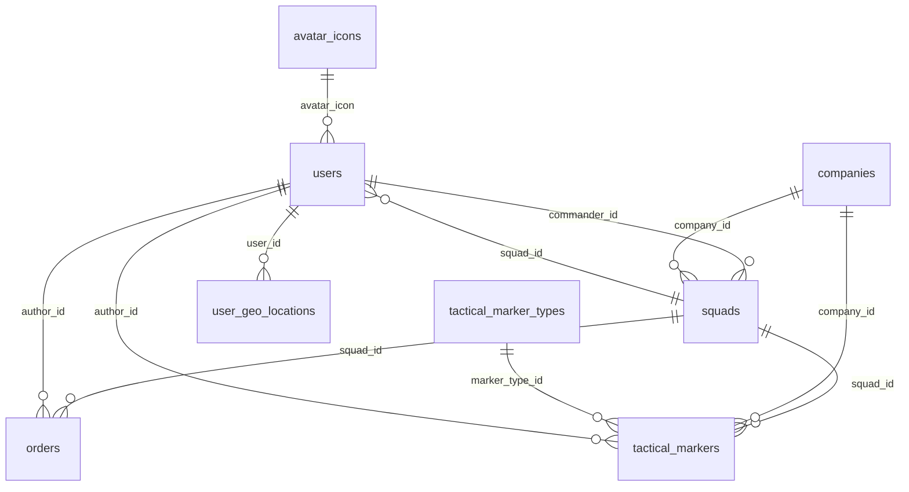

# Логическая схема БД STN

Документ описывает актуальную логическую модель данных STN согласно миграции `V1__init_schema.sql` и реализованной JPA-модели. Основные сущности охватывают пользователей, иерархию подразделений (роты/отряды), тактические объекты (метки, приказы) и историю геопозиций.

## Логическая диаграмма
Диаграмма отражает ключевые таблицы, первичные/внешние ключи и кардинальности (1 — одна запись, N — множество, o — опционально).

## Ключевые таблицы и ограничения

### `avatar_icons`
- Назначение: справочник аватаров, на который ссылаются пользователи.
- Основные поля: `id` (PK), `key` (уникальный идентификатор), `label`, `image_url`, `active` (NOT NULL, по умолчанию `TRUE`).
- Ограничения: `key` уникален и используется как FK из `users.avatar_icon` (ON DELETE RESTRICT).

### `users`
- Назначение: учетные записи игроков/администраторов.
- Основные поля: `id` (PK), `email` (уникальный, NOT NULL), `password_hash`, `nickname`, `system_role` (`user_system_role`, NOT NULL, по умолчанию `USER`), `account_status` (`user_account_status`, NOT NULL, по умолчанию `ACTIVE`) — статус аккаунта (`ACTIVE|BLOCKED|DELETED`), `status` (`user_status`, NOT NULL, по умолчанию `ALIVE`) — внутриигровой статус (`ALIVE|DEAD`), `avatar_icon` (FK на `avatar_icons.key`, NOT NULL), `squad_id` (FK на `squads.id`, nullable), `created_at`, `updated_at`.
- Ограничения и связи:
  - `account_status` и `status` независимы: блокировка аккаунта не означает `DEAD`, а `DEAD` не блокирует вход.
  - 1:N с `avatar_icons` (обязательная ссылка, удаление аватара запрещено, пока есть пользователи).
  - 1:N с `squads` через `squad_id` (участие в одном отряде, при удалении отряда ссылка обнуляется `ON DELETE SET NULL`).

### `companies`
- Назначение: роты/крупные подразделения.
- Основные поля: `id` (PK), `name` (NOT NULL), `description`, `is_open` (NOT NULL, по умолчанию `TRUE`), `created_at`, `updated_at`.
- Индексы: `is_open` для фильтрации по доступности.

### `squads`
- Назначение: отряды, принадлежащие ротам и имеющие командира.
- Основные поля: `id` (PK), `name` (NOT NULL), `description`, `is_open` (NOT NULL), `color` (NOT NULL), `company_id` (FK на `companies.id`, nullable), `commander_id` (FK на `users.id`, NOT NULL), `created_at`, `updated_at`.
- Ограничения и связи:
  - Каждый отряд опционально принадлежит роте (`ON DELETE SET NULL`).
  - У отряда обязательный командир (`ON DELETE RESTRICT`), при удалении пользователя-командира блокируется удаление.
  - Обратная связь с `users` через `users.squad_id` реализует членов отряда (1:N).

### `tactical_marker_types`
- Назначение: каталог типов тактических меток и правил их использования.
- Основные поля: `id` (PK), `key` (уникальный, NOT NULL), `name` (NOT NULL), `default_description`, `icon`, `default_lifetime_seconds`, `role_restriction` (NOT NULL), `can_send_to_company` (NOT NULL), `uniqueness_policy` (NOT NULL), `category`, `active` (NOT NULL).
- Индексы: `active` для быстрых выборок актуальных типов.

### `orders`
- Назначение: приказы внутри отряда.
- Основные поля: `id` (PK), `squad_id` (FK на `squads.id`, NOT NULL), `author_id` (FK на `users.id`, nullable), `description` (NOT NULL), `status` (`order_status`, NOT NULL, по умолчанию `ACTIVE`), `created_at`, `completed_at`.
- Ограничения и связи:
  - При удалении отряда приказы удаляются каскадно (`ON DELETE CASCADE`).
  - При удалении автора ссылка обнуляется (`ON DELETE SET NULL`).

### `tactical_markers`
- Назначение: размещенные тактические метки на карте.
- Основные поля: `id` (PK), `marker_type_id` (FK на `tactical_marker_types.id`, NOT NULL), `squad_id` (FK на `squads.id`, NOT NULL), `company_id` (FK на `companies.id`, nullable), `author_id` (FK на `users.id`, nullable), `lat`, `lng` (оба NOT NULL), `description`, `created_at` (NOT NULL), `expires_at`.
- Индексы: по `squad_id`, `company_id`, `marker_type_id`, `expires_at`, а также частичный индекс активных меток по отряду/типу.
- Ограничения и связи:
  - Метка принадлежит отряду (касCADE при удалении отряда).
  - Может быть адресована в роту (`company_id`) или создана автором-пользователем (обнуление FK при удалении связанных записей).
  - Тип метки обязателен (`ON DELETE RESTRICT`).

### `user_geo_locations`
- Назначение: история координат пользователей.
- Основные поля: `id` (PK), `user_id` (FK на `users.id`, NOT NULL), `lat`, `lng` (оба NOT NULL), `recorded_at` (NOT NULL, по умолчанию `now()`).
- Ограничения: при удалении пользователя история удаляется каскадно (`ON DELETE CASCADE`). Индекс по `user_id, recorded_at DESC` для выборок последних точек.

## Ключевые отношения (1:N, N:M)
- **Пользователь → Аватар**: многие пользователи ссылаются на один аватар (обязательная FK). Удаление аватара невозможно, пока есть ссылки.
- **Рота → Отряды**: одна рота содержит множество отрядов, связь опциональна для отряда.
- **Отряд → Командир**: обязательный `ManyToOne` на пользователя; блокирует удаление командира, если он назначен.
- **Отряд ↔ Пользователи**: `users.squad_id` реализует членство (каждый пользователь в 0 или 1 отряде; множество пользователей на один отряд).
- **Отряд → Приказы**: каскадное удаление приказов вместе с отрядом.
- **Отряд → Тактические метки**: все метки привязаны к отряду (каскадное удаление при удалении отряда).
- **Тип метки → Метки**: обязательная FK, удаление типа запрещено, если есть метки.
- **Пользователь → Метки / Геолокации / Приказы**: авторы и координаты привязаны к пользователю; при удалении пользователя ссылки обнуляются (для меток/приказов) или записи удаляются (геолокации).

## Соответствие таблиц доменным объектам и JPA
| Таблица | JPA-сущность | Основные связи в модели |
| --- | --- | --- |
| `avatar_icons` | `AvatarIcon` | `@OneToMany(mappedBy="avatarIcon")` → `User` (список пользователей, выбравших аватар). |
| `users` | `User` | `@ManyToOne` → `AvatarIcon` (обязательно); `@ManyToOne` → `Squad` (членство); `@OneToMany(mappedBy="commander")` → `Squad` (командуемые отряды); `@OneToMany(mappedBy="author")` → `Order`, `TacticalMarker`; `@OneToMany(mappedBy="user")` → `UserGeoLocation`. |
| `companies` | `Company` | `@OneToMany(mappedBy="company")` → `Squad`, `TacticalMarker`. |
| `squads` | `Squad` | `@ManyToOne` → `Company` (опционально); `@ManyToOne` → `User` как `commander` (обязательно); `@OneToMany(mappedBy="squad")` → `User` (члены), `Order`, `TacticalMarker`. |
| `tactical_marker_types` | `TacticalMarkerType` | `@OneToMany(mappedBy="markerType")` → `TacticalMarker`. |
| `orders` | `Order` | `@ManyToOne` → `Squad` (обязательно); `@ManyToOne` → `User` как автор (опционально). |
| `tactical_markers` | `TacticalMarker` | `@ManyToOne` → `TacticalMarkerType` (обязательно); `@ManyToOne` → `Squad` (обязательно); `@ManyToOne` → `Company` (опционально); `@ManyToOne` → `User` как автор (опционально). |
| `user_geo_locations` | `UserGeoLocation` | `@ManyToOne` → `User` (обязательно). |

### Нюансы моделирования
- Явные таблицы/сущности используются вместо `@ManyToMany`; членство в отряде моделируется FK `users.squad_id`, что упрощает хранение статуса и единственности членства.
- Бизнес-роль командира не требует отдельной таблицы: обязательная ссылка `squads.commander_id` и обратное поле `User.commandedSquads` фиксируют 1:N.
- Типы меток вынесены в отдельный справочник (`tactical_marker_types`) с флагами ограничений (`role_restriction`, `uniqueness_policy`), что позволяет JPA-слою проверять правила без дублирования данных.

## Политики целостности и жизненный цикл данных
- Каскадное удаление применяется для зависимых сущностей, связанных с отрядом (`orders`, `tactical_markers`) и историей координат пользователей (`user_geo_locations`).
- Обнуление FK (`ON DELETE SET NULL`) используется там, где важна сохранность исторических записей (автор метки/приказа, принадлежность метки роте, членство пользователя при удалении отряда).
- Запрет удаления (`ON DELETE RESTRICT`) защищает справочники и ключевые роли (аватар, командир отряда, тип метки) от случайной потери, пока на них есть ссылки.
- Индексы (отдельные и частичные) поддерживают частые выборки: открытые роты/отряды, активные типы и метки, свежие геолокации.
